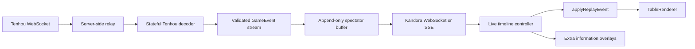

# Tenhou live spectating feasibility

Date: 2026-08-08

## Verdict

This is feasible as a prototype, with medium implementation and operational risk.
The existing Kandora event model, replay reducer, and Pixi table renderer are a
good fit. The main new work is a stateful Tenhou live-protocol adapter and a
server-side relay. The browser should not connect directly to Tenhou until an
active experiment proves that Tenhou accepts Kandora's browser origin and that
doing so complies with Tenhou's terms.

The first offline milestone is complete: `extract.har` is parsed into Kandora
`GameEvent`s, every event is validated with `GameEventSchema`, and each captured
session is folded through the replay reducer. This confirms the central data
compatibility assumption before any live connection or deployment work.

## Offline spike result

The spike added `app/api/tenhou/spectateHarAdapter.ts` and its fixture test. It
also extracted `parseTenhouReplayElements` from the existing replay adapter so
XML replay logs and HAR JSON child nodes use the same semantic decoder.

The enriched HAR now contains three joins to the same watch id. They are kept
as separate catch-up sessions because reconnect snapshots overlap earlier
events and cannot safely be concatenated without a deduplication strategy.

The primary session produces 678 schema-valid events across seven hands:

- 1 match start
- 7 hand starts
- 323 draws
- 330 discards
- 8 calls
- 6 hand ends
- 3 wins

It also retains 386 numeric timing values beside the 683 normalized Tenhou
elements. The two reconnect snapshots independently produce 39 and 380 events.
The third contains an authoritative match-ending `owari` and therefore emits a
real `match_end`; the two partial captures omit the whole-log parser's synthetic
ending. All three sequences fold through `replayReducer` without throwing.
Calls, wins, riichi declaration discards, exhaustive draws, four 13-tile
starting hands, cross-hand transitions, and match completion are covered.

The development-only simulator at `/replays/tenhou-har` projects captured
element delays onto domain events and progressively grows an in-memory stream
head. It supports 1x/4x/16x playback, feed pause/restart, view pause, buffered
stepping and scrubbing, go-live catch-up, capture selection, seat focus, visible
hands, and wait overlays. Browser checks confirmed that the stream continues
while the view is paused, go-live catches up without changing the event buffer,
the Pixi table is nonblank, and controls fit without overlap on desktop and
mobile.

This is still an offline bridge, not the production live decoder. It does not
merge reconnect snapshots, assign stable source event ids, or resolve a gap
after disconnect. Those remain explicit requirements for the relay spike.

## What the capture proves

The HAR contains one successful WebSocket upgrade:

- URL: `wss://b-ww.mjv.jp/`
- 455 frames: 243 sent and 212 received
- Duration: about 1,469.4 seconds
- Request `Origin`: `https://tenhou.net`
- No `Cookie` or authorization header is present in the WebSocket handshake
- `permessage-deflate` was requested, but it is not present in the recorded
  response headers

The observed control flow is:

1. Send JSON `HELO`.
2. Receive `HELO` and lobby `LN` messages.
3. Send `WG` with an eight-character watch id and `tw: 0`.
4. Receive `GO`, then send `GOK`.
5. Receive player metadata in `UN` and a spectator notice in `KANSEN`.
6. Receive `INITBYLOG`, followed by incremental `WGC` batches.
7. Send text `<Z/>` keepalives approximately every 10 seconds.

`INITBYLOG.childNodes` is a catch-up bundle. In this capture it contains an
`INIT` state followed by 36 values/actions that had already occurred.
`WGC.childNodes` continues the same stream. Child nodes are either:

- a number, apparently an animation/presentation delay in milliseconds; or
- an object with a Tenhou tag such as `T32`, `D32`, `N`, `RYUUKYOKU`, or
  `INIT`.

The captured `INIT` includes `seed`, `ten`, `oya`, and all four `haiN` fields.
Each `haiN` contains 13 physical tile ids, so this spectator feed is
omniscient at hand start. The final captured batch contains `RYUUKYOKU`, the
next `INIT`, and the first draw of the new hand. This is enough to demonstrate
cross-hand continuity.

## What the capture does not prove

The following require additional captures or active tests:

- Whether Tenhou rejects a WebSocket whose `Origin` is not `tenhou.net`.
- How a current public game or normal Tenhou log id maps to the short `WG.id`.
- Reconnect behavior, resumability, timeout behavior, and duplicate delivery.
- How the stream signals a failed or expired watch id.
- Coverage for multi-ron, `DORA`, every kan type, abortive draws, disconnects,
  and three-player games.
- Whether the numeric child nodes are exact playback delays or should only be
  treated as advisory timing.
- Whether the observed batching cadence is fixed, load-dependent, or an
  intentional anti-cheating spectator delay.

The HAR must not be treated as evidence that the protocol is stable or
supported. It is an undocumented private protocol and can change without
notice.

## Fit with the existing app

The current Tenhou XML adapter already implements most of the semantic mapping
needed by a live decoder:

- physical tile id to Kandora tile
- `T/U/V/W` draws and `D/E/F/G` discards
- packed `N.m` meld decoding
- `REACH`, `DORA`, `AGARI`, and `RYUUKYOKU`
- Tenhou score units to Kandora points

See `app/api/tenhou/replayAdapter.ts`. Its output is the neutral `GameEvent`
union in `app/game/protocol/messages.ts`. Those events can already be folded by
`applyReplayEvent` in `app/game/replay/player.ts` and converted to the
`MatchView` consumed by `TableRenderer`.

The existing whole-log parser cannot simply be called once per `WGC` frame. It
resets decoder state, expects a complete replay, optionally reconstructs walls
from a `SHUFFLE` seed, and appends `match_end` when input ends. Live ingestion
therefore needs a stateful decoder that preserves at least:

- player metadata and current scores
- last discard tile and seat for call decoding
- pending riichi declaration
- current dora indicators
- current hand and match lifecycle
- a monotonically increasing Kandora sequence number
- enough identity to deduplicate frames after reconnect

The decoder should share pure tile, meld, and element-to-event helpers with the
replay adapter. It should not convert live JSON back to pseudo-XML strings.

## Proposed architecture

### Relay

Use a long-lived backend process, not a React Router request handler, to own the
Tenhou socket, keepalive, reconnect policy, and fan-out to Kandora viewers. The
existing game server may be the right host, but that should be decided from the
deployment topology rather than coupling the first parser spike to it.

The relay should expose only Kandora's validated protocol to browsers. It must
rate-limit watch creation, bound per-watch buffers, share one upstream Tenhou
connection among viewers of the same game, and remove upstream identity fields
that the UI does not need.

### Decoder

Introduce a stateful decoder around the same normalized element shape used by
the XML adapter. It should accept `UN`, `INITBYLOG`, and `WGC` envelopes and
return zero or more `GameEvent`s plus optional timing metadata. Keep timing out
of `GameEvent` initially; store it beside each buffered event so the domain
protocol remains platform-neutral.

Every emitted event must pass `GameEventSchema`. Unknown tags should be logged
with bounded sampling and skipped only when they are known to be non-stateful;
an unknown state-changing tag should pause the stream and force a resync rather
than silently corrupting the table.

### UI

Build the first spectator screen from the replay state path, not the live-player
Zustand path. A streaming replay model naturally supports:

- append-only incoming events
- a playhead separate from the newest event
- follow-live on/off
- pause, step, and rewind within the retained buffer
- a visible delayed/live status
- seat rotation and existing replay overlays

The static replay route currently combines loading, review editing, timeline
controls, and rendering. Extract only the table/timeline presentation needed by
both routes; do not make the Tenhou relay pretend to be a playable Kandora
match.

## Additional information that is realistic

Because the capture exposes all four starting hands and physical tile ids, the
app can derive more than Tenhou's stock table presentation without predicting
future tiles:

- current shanten and waits for every visible hand
- tile remaining counts and discard visibility
- genbutsu/suji-style danger indicators based on public history
- score deltas, placement pressure, dealer/honba/riichi context
- tsumogiri, derived by comparing a discard's physical id with the preceding
  draw for that seat
- action timing and stream latency, if numeric child timing is validated

Do not promise the existing wall overlays. The live feed has no observed
`SHUFFLE` seed, so future live-wall order, dead-wall contents, ura-dora, and a
future draw schedule are unknown. They should remain hidden until revealed.

Wait calculation is already available through `app/services/annotateWaits.ts`,
but its current API precomputes a complete replay. A live view should expose or
add an incremental `computeCurrentWaits(view)`-style helper rather than rerun
the whole annotation pass after every batch.

## Suggested spike sequence

### 1. Offline protocol fixture

- Add a HAR fixture reader used only by tests.
- Normalize `INITBYLOG` and `WGC` child nodes.
- Extract reusable Tenhou tag decoding from the whole-log adapter.
- Validate every emitted event with `GameEventSchema`.
- Fold all events with `applyReplayEvent` and assert the final state.
- Assert four 13-tile starting hands, cross-hand transition, calls, scores, and
  physical tile identity.

Exit gate: the full capture renders without schema errors or reducer
inconsistencies. This is the cheapest check that can falsify feasibility.

### 2. Offline spectator route

Status: complete.

- Feed the decoded fixture to a minimal streaming timeline controller.
- Mount the existing `TableRenderer` with follow-live, pause, and seat focus.
- Preserve numeric timing separately and compare timed playback with a
  frame-at-a-time mode.
- Add one incremental information overlay, preferably waits/shanten.

Exit gate: desktop and mobile screenshots show the same table state as the
captured Tenhou session, and scrubbing never changes the appended event buffer.

### 3. Controlled relay experiment

- Confirm Tenhou's origin policy from a disposable server-side client.
- Determine how watch ids are discovered and expire.
- Measure actual batch delay, heartbeat requirements, disconnect behavior, and
  reconnect semantics.
- Capture at least one win, riichi, kan/dora, multi-ron or abortive draw, and
  match end.
- Review Tenhou terms and expected request volume before persistent deployment.

Exit gate: a relay survives a forced disconnect without duplicating or
silently skipping state, or it clearly informs viewers that it must wait for a
safe hand-boundary resync.

### 4. Production hardening

- Fan out one upstream socket per watched game.
- Add bounded retention, idle cleanup, rate limits, metrics, and structured
  unknown-tag logging.
- Define viewer authorization and any anti-cheating delay policy.
- Persist a replay only after the stream is complete and validated; incomplete
  streams must remain marked as partial.

## Go/no-go criteria

Proceed beyond the offline spike only if:

- all captured state maps cleanly to `GameEvent` without UI-specific events;
- a compliant and operationally acceptable way to obtain watch ids exists;
- Tenhou permits the integration or the project accepts the private-protocol
  maintenance risk;
- reconnect can resync safely, or the product accepts waiting until the next
  `INIT` after a gap; and
- the spectator delay is sufficient for the intended tournament integrity
  policy.

Stop or redesign if watch ids require automating privileged account behavior,
Tenhou blocks/forbids relay access, or missing events can leave viewers with a
plausible but incorrect table state.